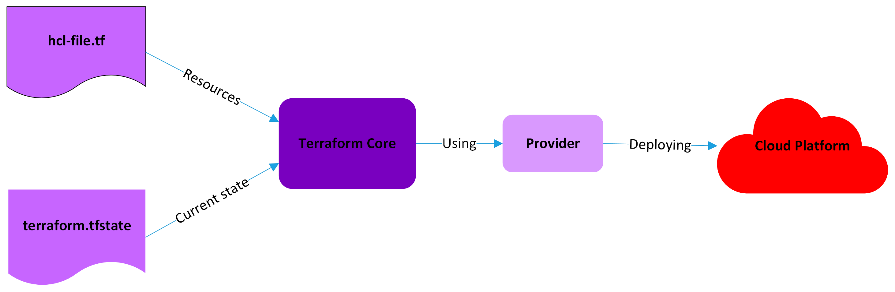

# Introduction to Infrastructure as code with Terraform and Google Cloud Platform

## Google Cloud Platform

Google Cloud Platform offers a variety of cloud computing services including cloud storage various computing services such as virtual private networks, virtual machines, a Kubernetes engine, SQL database instances and more.\
These cloud computing resources are managed through either a browser based graphical user interface or the Google Cloud CLI in the terminal.

## Issues of managing infrastructure manually

To be able to recreate an environment from scratch it is necessary to carefully document all configuration details of all resources as well as the correct order in which to create them.\
All of those can be
During development or operations it is very easy to get into a situation where small changes are introduced which are not documented and after a while those differences can grow and become overwhelming, maybe even create security risks. This is known as configuration drift and one of the main issues infrastructure as code (IaC) tries to solve.

## Infrastructure as Code

IaC describes a automated method of managing and provisioning computing resources by use of machine readable definition files. As long as changes are only made trough this process These files are also human readable and therefore can serve as a basic documentation of the existing infrastructure. Further benefits to the IaC approach of managing infrastructure include the opportunity continuous delivery of new additions and bug fixes, increased commonality in tooling between development and operations and more.

## Terraform

Terraform is a open-source infrastructure as code code tool by HashiCorp. It uses the domain-specific declarative HashiCorp Configuration Language and supports a wide variety of cloud infrastructure providers. Terraform is primarily used to deploy infrastructure but is also able to install software on the machines it provides and to deploy applications there.

## Terraform architecture

The most important elements of an infrastructure project with Terraform are the configuration files, the terraform state file, Terraform itself and the providers. The most important components and their relation is depicted in the basic diagram below.

<p style="text-align: center;">*Basic Terraform architecture*</p>

The **<span>hcl-file.tf</span>** represents the actual configuration file or files that describe the infrastructure.\
The **terraform.tfstate** file is a very important file in any Terraform project. It contains the information on the currently deployed infrastructure and is the "source of truth" about the current state. It is created and managed by terraform and should never be changed by hand.\
The **Terraform Core** represents the main software component of Terraform.
The **Providers** are plugins that serve as the connection between Terraform and the **cloud platform** where the infrastructure is to be deployed. They are installed as required for the individual platform that will be used.

## Terraform resource structure and basic HCL syntax

The HCL language uses two main constructs: *arguments* and *blocks*.
An *argument* looks like a variable in any other language:

```terraform
account_id = "jsa-sa"
```

Left of the equal-sign is the argument name and right of it is the value.\
A *block* is a container for other blocks and arguments.
```terraform
resource "google_compute_network" "jsa_vpc_network" {
  name = "jsa-terraform-network"
}
``` 

The blocks type is in front of it, here it is *resource*. The type of the block defines how many labels a block type has, in this instance it is two. Those are used to reference a block in other parts of the code. Which resource types are available, here *google_compute_network* is used, is defined by the installed provider.\
Lables and arguments can then be used to reference a specific resource in other parts of the terraform project:

```terraform
resource "google_compute_firewall" "jsa_vm_firewall" {
  name = "jsa-terraform-firewall"

  network = google_compute_network.jsa_vpc_network.name

  allow {
    protocol = "tcp"
    ports    = ["22"]
  }
}
```

The network argument reference the previously defined *google_compute_network* and is protecting that specific network.\
The network argument is required for the *google_compute_firewall*, it cannot be created if a required argument is not present.

## Basic Terraform workflow

After identifying the required cloud resources and creating the corresponding terraform files the typical workflow looks something like this:

```bash
$ terraform init
```
The init command installs and configures the required terraform providers. 

```bash
$ terraform plan
```
The plan command creates a preview of the changes that will be made to the currently deployed resources.

```bash
$ terraform apply
```
The apply command will execute those changes.

```bash
$ terraform destroy
```
The destroy command will tear down the deployed infrastructure.

To keep track of deployed resources Terraform manages those in a file defining the current state, the `terraform.tfstate` file.\
 In a later chapter the safe and efficient management of this extremely important file will be discussed, for a small test project it is sufficient to keep it in the local directory where it will be created and managed automatically.

