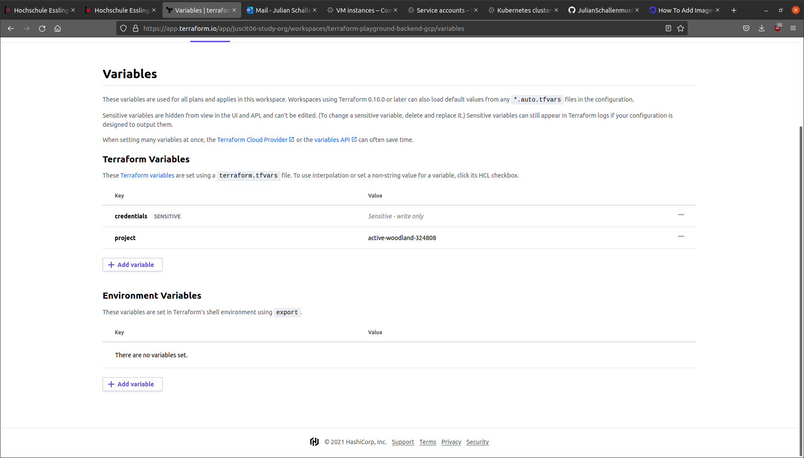

# Introduction to Infrastructure as code with Terraform and Google Cloud Platform

## Google Cloud Platform

Google Cloud Platform offers a variety of cloud computing services including cloud storage various computing services such as virtual private networks, virtual machines, a Kubernetes engine, SQL database instances and more.\
These cloud computing resources are managed through either a browser based graphical user interface or the Google Cloud CLI in the terminal.

## Issues of managing infrastructure manually

To be able to recreate an environment from scratch it is necessary to carefully document all configuration details of all resources as well as the correct order in which to create them.\
All of those can be
During development or operations it is very easy to get into a situation where small changes are introduced which are not documented and after a while those differences can grow and become overwhelming, maybe even create security risks. This is known as configuration drift and one of the main issues infrastructure as code (IaC) tries to solve.

## Infrastructure as Code

IaC describes a automated method of managing and provisioning computing resources by use of machine readable definition files. As long as changes are only made trough this process These files are also human readable and therefore can serve as a basic documentation of the existing infrastructure. Further benefits to the IaC approach of managing infrastructure include the opportunity continuous delivery of new additions and bug fixes, increased commonality in tooling between development and operations and more.

## Terraform

Terraform is a open-source infrastructure as code code tool by HashiCorp. It uses the domain-specific declarative HashiCorp Configuration Language and supports a wide variety of cloud infrastructure providers. Terraform is primarily used to deploy infrastructure but is also able to install software on the machines it provides and to deploy applications there.

### Terraform architecture

The most important elements of an infrastructure project with Terraform are the configuration files, the terraform state file, Terraform itself and the providers. The most important components and their relation is depicted in the basic diagram below.

<p style="text-align: center;">*Basic Terraform architecture*</p>

The **<span>hcl-file.tf</span>** represents the actual configuration file or files that describe the infrastructure.\
The **terraform.tfstate** file is a very important file in any Terraform project. It contains the information on the currently deployed infrastructure and is the "source of truth" about the current state. It is created and managed by terraform and should never be changed by hand.\
The **Terraform Core** represents the main software component of Terraform.
The **Providers** are plugins that serve as the connection between Terraform and the **cloud platform** where the infrastructure is to be deployed. They are installed as required for the individual platform that will be used.

### Terraform resource structure and basic HCL syntax

The HCL language uses two main constructs: *arguments* and *blocks*.
An *argument* looks like a variable in any other language:

```terraform
account_id = "jsa-sa"
```

Left of the equal-sign is the argument name and right of it is the value.\
A *block* is a container for other blocks and arguments.
```terraform
resource "google_compute_network" "jsa_vpc_network" {
  name = "jsa-terraform-network"
}
``` 

The blocks type is in front of it, here it is *resource*. The type of the block defines how many labels a block type has, in this instance it is two. Those are used to reference a block in other parts of the code. Which resource types are available, here *google_compute_network* is used, is defined by the installed provider.\
Lables and arguments can then be used to reference a specific resource in other parts of the terraform project:

```terraform
resource "google_compute_firewall" "jsa_vm_firewall" {
  name = "jsa-terraform-firewall"

  network = google_compute_network.jsa_vpc_network.name

  allow {
    protocol = "tcp"
    ports    = ["22"]
  }
}
```

The network argument reference the previously defined *google_compute_network* and is protecting that specific network.\
The network argument is required for the *google_compute_firewall*, it cannot be created if a required argument is not present.

### Terraform input variables

Input variables are useful to change parameters outside of the source code such as a project Id for example. A variable is defined as a single block with an argument.

```terraform
variable "gke_username" {
  default     = "jsa"
  description = "gke username"
}
```
The blocks type is variable, the label by which it can be referenced is gke_username and it contains two arguments, the first is a (required) default value and the second a optional description.\
If a `terraform.tfvars` file is present variables are filled using the contents of that file which are simple key-value pairs. Variables can also be sensitive and stored in a backend, examples for this are demonstrated in a later chapter.

### Terraform output variables

Parameters such as an external IP address are often only known after creation of the corresponding resource, therefore it is useful to have an option to call upon those values. Terraform output variables serve the purpose of exposing attributes to other components or simply displaying the values for easy access to them.

```terraform
output "lb_ip" {
  value = kubernetes_service.jsa_testapp_lb.status.0.load_balancer.0.ingress.0.ip
  description = "External loadbalancer ip"
}
```
This example exposes the public IP address of a kubernetes loadbalancer on which a deployed application can be accessed.

### Basic Terraform workflow

After identifying the required cloud resources and creating the corresponding terraform files the typical workflow looks something like this:

```bash
$ terraform init
```
The init command installs and configures the required terraform providers. 

```bash
$ terraform plan
```
The plan command creates a preview of the changes that will be made to the currently deployed resources.

```bash
$ terraform apply
```
The apply command will execute those changes.

```bash
$ terraform destroy
```
The destroy command will tear down the deployed infrastructure.

To keep track of deployed resources Terraform manages those in a file defining the current state, the `terraform.tfstate` file.\
 In a later chapter the safe and efficient management of this extremely important file will be discussed, for a small test project it is sufficient to keep it in the local directory where it will be created and managed automatically.

## Example project 1: A simple Ubuntu virtual machine

### Terraform files

For better overview the terraform code is structured into multiple files. 
The file `terraform.tf` specifies the required providers including version, in this case the google provider in the version 3.5.0.\
Information on the google provider such as the path to the local credentials file are defined in `provider.tf` and the actual resources definitions are placed in `resources.tf`.

### Connecting to the Ubuntu VM

There are several ways how a SSH connection to a Linux VM can be established, four methods will be described here in short, including  their advantages and disadvantages. Of course each project has different requirements and choosing the appropriate method is important to achieve a sufficient level of security while keeping the configuration simple.

### Google Cloud CLI

Google Cloud Platform provides several ways of connecting to VM's 
The simplest method requires the gcloud CLI with authorized Cloud SDK tools:

```bash
$ gcloud compute ssh --project=<project-id> --zone=<zone> <VM name>
```
By connecting using the Google CLI there are no other further steps and configuration required, therefore it is the quickest and simplest way to connect, not requiring further configuration also reduces the chance of introducing security issues by erroneous configuration.\
The obvious disadvantage is the requirement for the installed and configured Google CLI, a third-party without won't be able to connect and make use of this VM.

### SSH keys managed in VM metadata manually

Another simple option is to directly manage SSH keys in the metadata of the VM manually by hand. After creating a key pair using a tool such as `ssh-keygen` on Linux the public key is embedded into the metadata of the GCloud Compute Instance as a key-value pair:

```terraform
 metadata = {
    "ssh-keys" = "[USERNAME]:ssh-rsa [KEY] [USERNAME]"
  }
```

Now a connection can be established with the standard ssh command.
```bash
$ ssh -i /path/to/identity-file user@external-ip-address
```

With this setup it is easy to allow any user to access the machine, however due to the manual management of the individual keys by hand human error might introduce security risks such as keys that are due to be deleted are forgotten. Some of that risk might be mitigated by assigning expiry dates to all keys, however the approach of manual management of SSH keys in metadata is discouraged by Google.

### Connect via service accounts

It is possible to enable OS Login and also allow external users without a Google Cloud Platform account to access the machines, the setup to achieve this however is a little more complex and requires more steps. The basic idea is to use a service account to still allow for access management to be done via IAM while not requiring a Google Cloud Platform account to establish a connection.

First a service-account needs to be created and added inside the code block for the VM:

```terraform
resource "google_service_account" "jsa_service_account" {
  account_id = "jsa-sa"
}

resource "google_compute_instance" "jsa_vm_instance_sa" {

...

  metadata = {
    enable-oslogin = "TRUE"
  }

  service_account {
    email = "jsa-temp@active-woodland-324808.iam.gserviceaccount.com"
    scopes = ["https://www.googleapis.com/auth/cloud-platform"]
  }

...

}
```

Terraform is able to execute a local script to complete the setup:
```terraform
provisioner "local-exec" {
  command = "./local_scripts/iam-setup.sh"
}
```
This script completes the setup for the service account to allow access to the VM. It assigns the required roles to the service account, creates required keys and saves the username in a simple .txt file. By using this username, the external IP of the VM and the private key that has been created the machine can be accessed from any computer with an SSH client.

## Example project 2: A simple Kubernetes cluster with a minimal example app deployed

Similar to it's competition from Amazon and Microsoft GCP provides a Kubernetes Service, the Google Kubernetes Engine (GKE).\
this simple example deploys a minimal cluster with one node in a single zone. A minimal nodejs application is then deployed onto the cluster.
The Terraform resources deployed are divided into the file `gke.tf` and `kubernetes.tf`.\
 The resources defined in `gke.tf` are those required for the kubernetes cluster, a google_container_cluster resource and the google_container_node_pool which is then attached to the cluster: 

```terraform
resource "google_container_node_pool" "jsa_primary_nodes" {
  ...

  cluster    = google_container_cluster.jsa_primary.name
  node_count = var.gke_num_nodes

  node_config {
  ...

}
```

The cluster resource can be deployed into either regions or zones, if deployed into a region it will create a cluster in each of the regions zones, increasing availability.

The `kubernetes.tf` file describes the kubernetes-related resources, a deployment for the application and and a load balancer kubernetes service.\
These resources look extremely similar to how the .yaml definitions for kubernetes would like, here to load balancer as an example:

```terraform
resource "kubernetes_service" "jsa_testapp_lb" {
  metadata {
    name =  "jsa-testapp-example"
  }

  spec {
    selector = {
      App = kubernetes_deployment.jsa_testapp.spec.0.template.0.metadata[0].labels.App
    }
    port {
      port = 8081
      target_port = 8080
    }

    type = "LoadBalancer"
  }
}
```

## Example project 3: Demo for statefile and (sensitive) variables in backend

The terraform state file which is Terraforms source of truth about the state of any deployed resources can be stored in a remote backend such as Terraform Cloud.
Terraform recommends to do so in any production environment or when any meaningful infrastructure is managed due to the advantages it provides in safety and ease of collaboration with multiple team members working on the same project.
\
\
This is a simple example how to create a backend to store sensitive variables and the `terraform.tfstate` file in a backend, here the Terraform Cloud is being used.

`backend.tf`:

```terraform
terraform {
  backend "remote" {
    organization = "juscit06-study-org"

    workspaces {
      name = "terraform-playground-backend-gcp"
    }
  }
}
```

Sensitive variable in `variables.tf`:

```terraform
variable "credentials" {
  description = "gcp project key"
  type        = string
  sensitive   = true
}
```

The variable being used to authenticate to Google Cloud Platform:

```terraform
provider "google" {
  credentials = var.credentials

  project = var.project
  region  = var.region
  zone    = var.zone
}
```

Sensitive and non-sensitive variables in the Terraform Cloud: 



## Example project 4: Google Cloud Storage

This is a very small and minimal example for a storage bucket and on object being stored in it.

`storage.tf`:

```terraform
resource "google_storage_bucket" "jsa_terraform_bucket" {
  name = "jsa-terraform-bucket"

  location = "EU"
  force_destroy = true

  uniform_bucket_level_access = true
}
```

`stored-object.tf`:

```terraform
resource "google_storage_bucket_object" "hello" {
  name   = "hello"
  source = "./files/hello.txt"
  bucket = "jsa-terraform-bucket"

  depends_on = [
    google_storage_bucket.jsa_terraform_bucket
  ]
}
```

The only thing of note is the depends_on argument; without the storage bucket existing the object to be stored cannot be uploaded into it.\
In most cases Terraform is able to work out dependencies between resources without explicit input, in case it doesn't this is a way to do so.